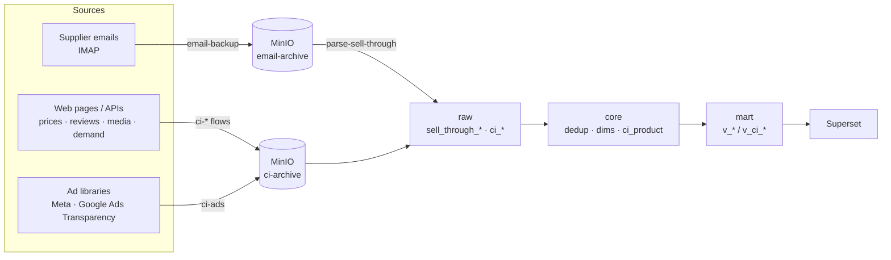

# ChannelHub — 进销存与竞品情报数据平台

现状：进销存与竞品情报两条数据线均已跑通——迁移、ETL、Prefect flow 与 Superset 看板齐备，`docker compose up -d` + `bash scripts/initialize.sh` 即可拉起。

## Overview

ChannelHub is a self-hosted data platform for channel sales (sell-through / inventory)
and competitive intelligence. Supplier report emails are archived to MinIO, parsed into
Postgres, and modelled through three schemas — `raw` (as-received), `core` (cleaned,
deduplicated, conformed dimensions) and `mart` (reporting views) — which Superset reads
for dashboards. The competitive-intelligence line (prices, reviews, social, media, ads,
search demand) follows the same path: every web page, API response or ad-library pull is
archived to MinIO first, then loaded into `raw.ci_*` and surfaced via `mart.v_ci_*`.
All jobs are Prefect 3 flows; everything runs from one `docker-compose.yml`.



Edge labels are Prefect deployment names (see `prefect.yaml`).

## 服务一览

| 服务 | 镜像 | 访问地址 | 用途 |
|---|---|---|---|
| PostgreSQL | `postgres:16` | `127.0.0.1:5432`(仅本机) | 主业务库 `channelhub` + `prefect` / `superset` 支撑库(同一实例) |
| pgAdmin | `dpage/pgadmin4:latest` | `127.0.0.1:5050`(仅本机) | 数据库可视化管理(已预注册服务器 ChannelHub-PG) |
| MinIO | `minio/minio:latest` | `127.0.0.1:9000/9001`(仅本机) | 源文件原样存档:桶 `email-archive`(邮件)、`ci-archive`(竞品情报抓取,flow 首次写入时自动建) |
| **Superset** | `apache/superset:4.1.1` | **`https://<PREFECT_PROXY_HOST>`(公网,主 BI)** | 主对外 BI 报表 — Caddy 反代 + 自签 HTTPS |
| Prefect 3 OSS | `prefecthq/prefect:3-latest` | `127.0.0.1:4200`(仅本机) | 任务编排 server;走 SSH 隧道访问(OSS 无认证不可公网暴露) |
| Caddy | `caddy:2` | `0.0.0.0:443` | HTTPS 反代到 Superset;证书 SAN 写 `PREFECT_PROXY_HOST` |
| wg-easy | `ghcr.io/wg-easy/wg-easy:15` | 隧道 `0.0.0.0:51820/udp`;管理 UI `127.0.0.1:51821`(仅本机) | WireGuard VPN — 远程设备走服务器固定 IP 出网;见 [docs/VPN.md](docs/VPN.md) |

> 镜像统一用滚动 tag 以保证可拉取；如需可复现环境，请在 `docker-compose.yml`
> 中固定为具体版本 tag。

> 平台有两条数据线：**进销存**（邮件 → MinIO → `raw.sell_through_*` → `mart`）与
> **竞品情报**（网页/API/广告库 → MinIO → `raw.ci_*` → `mart.v_ci_*`，见
> [docs/COMPETITIVE_INTEL.md](docs/COMPETITIVE_INTEL.md)）。二者共用同一套
> Postgres / MinIO / Prefect / Superset。
>
> 竞品情报线里的 `ci-digest` flow 会调用 **Anthropic API** 生成中文简报
> （`mart.ci_digest`），这是全项目**唯一按量付费**的外部依赖。不配
> `ANTHROPIC_API_KEY` 则只有这一个 flow 不可用，采集与看板不受影响。

## 前置条件

- 已安装 **Docker Engine + Docker Compose 插件**（`docker compose version` 可用）。
- 端口 `5432 / 5050 / 9000 / 9001 / 4200 / 443 / 51820(udp) / 51821` 未被占用（冲突时改 `docker-compose.yml` 里对应的宿主机端口）。
  > 443 给 Caddy（Superset HTTPS 反代）；若被占用改 `.env` 的 `PREFECT_HTTPS_PORT`。

## 快速开始

```bash
# 1. 准备环境变量（.env 已含 openssl 随机生成的密码；如需重置可参考模板）
cp .env.example .env   # 已有 .env 则跳过；重置密码：openssl rand -hex 24

# 2. 一键拉起全部服务
docker compose up -d

# 3. 查看状态（postgres 应为 healthy，minio-init 跑完即 exited 0）
docker compose ps

# 4. 初始化数据层（幂等，第一次必跑，之后改了迁移/seed 也可再跑）
bash scripts/initialize.sh
```

首启 PostgreSQL 时会自动执行 `db/init/00_create_support_databases.sql`，
创建 `prefect` **空支撑库**（不含业务表）。业务表/视图/物化层、
BI 只读角色 `bi_readonly`、GTIN 白名单 seed、Superset 数据源 + 仪表盘，
全部由 `scripts/initialize.sh` 串起来跑一次到位。

### `scripts/initialize.sh` 做了什么

依次跑六步,任意一步失败即停下(全部幂等,可重复跑):

1. 按编号顺序应用 `db/migrations/*.sql` — 建 `raw / core / mart` schema 与对象
   - 注:这些迁移设计为**前向应用一次**(002/003/005 互相重塑同一组视图)。
     脚本检测到 `core.gtin_whitelist` 存在就跳过本步,认为数据层已初始化。
     新增迁移(如未来的 007)请手动 `psql -f db/migrations/007_*.sql` 应用。
2. 用 `.env` 里 `BI_READONLY_PASSWORD` 设 `bi_readonly` 角色密码
3. 装载 `db/seed/gtin_whitelist.csv` 到 `core.gtin_whitelist`
4. 在 Postgres 建空的 `superset` 元数据库(若不存在);superset-init 容器会在里面建 schema
5. 调 `scripts/superset_setup.py` — Superset 用 admin 凭据注册 ChannelHub 数据源
6. 调 `scripts/superset_provision.sh` — 应用 BI 口径视图并重建全部 Superset 看板
   (与 deploy 调的是同一个脚本,push 后 deploy 会自动重放)

